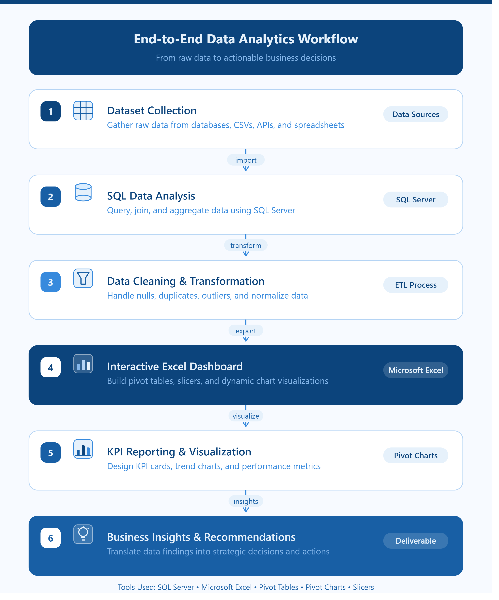

# HR-ATTRITION-DATA-ANALYSIS
End-to-End HR Employee Attrition Analysis using SQL Server and Excel Dashboard
# 📊 HR Employee Attrition Analysis

<p align="center">
  <b>End-to-End Data Analytics Project using SQL Server & Microsoft Excel</b><br>
  From raw HR data to actionable business insights.
</p>

---

## 🚀 Project Overview

This project analyzes employee attrition using SQL Server and Microsoft Excel. It demonstrates the complete data analytics workflow, including SQL querying, data cleaning, dashboard creation, KPI reporting, and business recommendations.

---

## 🔄 End-to-End Workflow

<p align="center">
  
</p>

---

## 📈 Interactive HR Dashboard

<p align="center">
  
</p>

---

## 🎥 Dashboard Demonstration

<p align="center">
  <a href="https://github.com/Mokshagnayadav-alt/HR-ATTRITION-DATA-ANALYSIS/blob/main/Dashboard/hr recording.mp4">
    
  </a>
</p>

<p align="center">
  <b>👆 Click the dashboard image above to watch the interactive dashboard demonstration.</b>
</p>

---

## 🛠️ Tools & Technologies

- SQL Server
- Microsoft Excel
- Pivot Tables
- Pivot Charts
- Slicers
- Data Cleaning
- KPI Reporting

---

## 📊 Key Performance Indicators (KPIs)

- 👥 Total Employees
- 📉 Attrition Count
- 📈 Attrition Rate
- 💰 Average Monthly Income

---

## 💡 Business Insights

🔹 HR and Sales departments have the highest attrition.
🔹 Overtime increases the likelihood of employees leaving.
🔹 Lower-paid employees are more likely to resign.
🔹 Employees with 2–5 years of tenure require focused retention strategies.
🔹 Job satisfaction alone does not guarantee employee retention.
🔹 Compensation and career growth are major drivers of long-term retention.
🔹 Improving work-life balance can help reduce employee turnover.

---

## 📂 Repository Structure

```
HR-Employee-Attrition-Analysis/
│
├── Dashboard/
│   ├── hr-dashboard.png
│   ├── workflow.png
│   └── dashboard-demo.mp4
│
├── Dataset/
│   ├── HR-Employee-Attrition.csv
│   └── HR-Employee-Attrition(Cleaned).xlsx
│
├── SQL Queries/
│   ├── KPI.pdf
│   └── KPI.docx
│
└── README.md
```

---

## 📬 Contact

If you like this project or would like a similar dashboard built for your business, feel free to connect with me on GitHub.

⭐ If you found this project useful, consider giving it a star!
